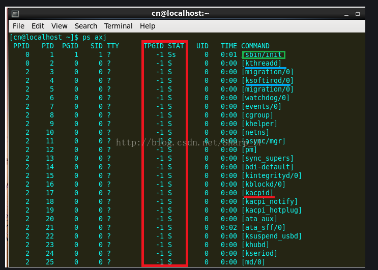

守护进程也称精灵进程（Daemon），是运行在后台的⼀一种特殊进程。它独立于控制终端且周期性地执行某种任务或等待处理某些发生的事件。守护进程是⼀一种很有用的进程。Linux的大多数服务器就是用守护进程实现的。比如，Internet服务器inetd，Web服务器httpd等。同时，守护进程完成许多系统任务。比如，作业规划进程crond等。Linux系统启动时会启动很多系统服务进程,用ps axj命令查看系统中的进程（参数a表示不仅列当前用户的进程,也列出所有其他用户的进程,参数x表示不仅列有控制终端的进程,也列出所有无控制终端的进程,参数j表示列出与 作业控制相关的信息）。

凡是TPGID一栏写着-1的都是没有控制终端的进程,也就是守护进程。在COMMAND一列用[] 括起来的 名字表示内核线程,这些线程在内核里创建,没有用户空间代码,因此没有程序文件名和命令行, 通常采用以k开头的名字,表示Kernel。init进程我们已经很熟悉了,udevd负责维护/dev目录下的 设备文件,acpid负责电源管理,syslogd负责维护/var/log下的日志文件,可以看出,守护进程通 常采用以d结尾的名字,表示Daemon。
